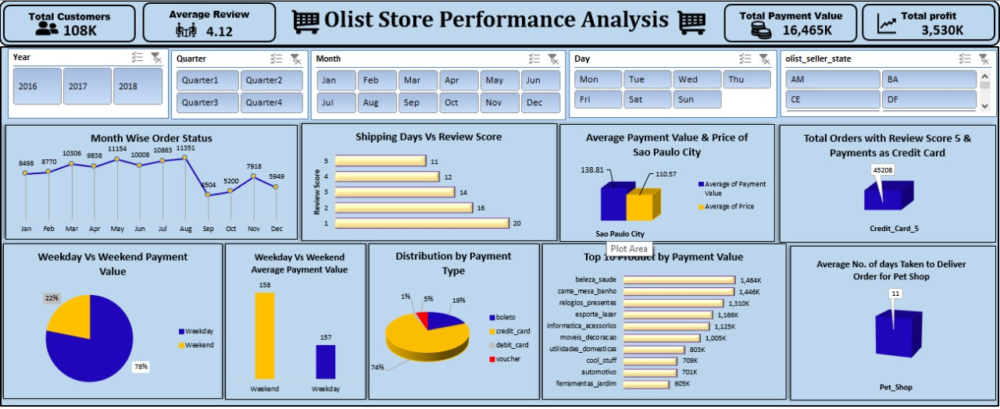

# 📊 Olist Store Performance Analysis - Excel Dashboard  

  

## 🚀 Overview  
This project is an **interactive Excel dashboard** designed to analyze the performance of the **Olist Store**, a Brazilian e-commerce platform.  
The dashboard provides key insights into **customer behavior, sales performance, payment trends, and product demand**.  

It allows users to filter data dynamically using **Year, Quarter, Month, and Seller State**, making it a powerful tool for business analysis.  

---

## 📌 Key Metrics Tracked  
### 📈 **Performance Indicators**  
- **Total Customers**: **108K**  
- **Average Review Score**: **4.12**  
- **Total Payment Value**: **16,465K**  
- **Total Profit**: **3,530K**  

### 📊 **Sales & Order Trends**  
- **Month-Wise Order Status**: A line chart representing order volume from **Jan to Dec**, showcasing seasonal trends.  
- **Top 10 Products by Payment Value**: Identifies the best-selling product categories, helping to prioritize inventory.  

### 🕵️ **Customer & Payment Behavior**  
- **Weekday vs Weekend Payments**:  
  - **78% of transactions occur on weekdays** vs **22% on weekends**.  
  - **Weekday Avg. Payment Value**: **157**  
  - **Weekend Avg. Payment Value**: **158**  
- **Payment Distribution**:  
  - **Credit Card - 74%** (Most preferred payment method)  
  - **Boleto - 19%**  
  - **Debit Card - 5%**  
  - **Voucher - 1%**  

### 🛍️ **City-Specific & Delivery Insights**  
- **Sao Paulo City - Avg. Payment Value vs Price**:  
  - **Avg. Payment Value**: **138.81**  
  - **Avg. Product Price**: **110.57**  
- **Shipping Days vs Review Score**:  
  - Orders delivered in **1-5 days have higher review scores** than orders taking **16+ days**.  
- **Pet Shop Orders - Avg. Delivery Time**: **11 Days**  

---

## 🛠️ Tools & Techniques Used  
- **Microsoft Excel**:  
  - Power Query for Data Cleaning  
  - Pivot Tables for Data Aggregation  
  - Slicers for Interactive Filtering  
  - Conditional Formatting for Highlighting Trends  
- **Data Visualization**:  
  - Line Charts  
  - Bar & Column Charts  
  - Pie Charts  
  - KPI Cards  

---
## 🎯 Business Insights & Use Cases  
- 🔹 **Retail Strategy**: Understand customer preferences and optimize stock levels for high-performing products.  
- 🔹 **Customer Satisfaction**: Analyze how shipping times impact review scores and improve logistics.  
- 🔹 **Payment Trends**: Identify the most used payment methods and strategize promotions accordingly.  
- 🔹 **Operational Efficiency**: Track delivery times and work on reducing delays for better service. 
